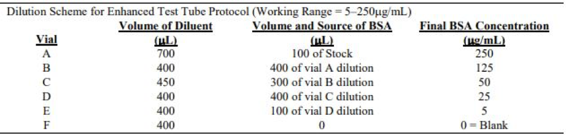
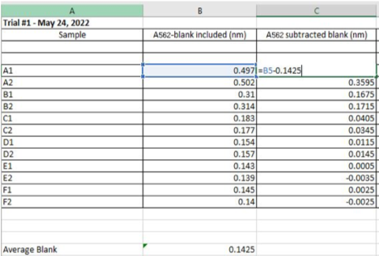
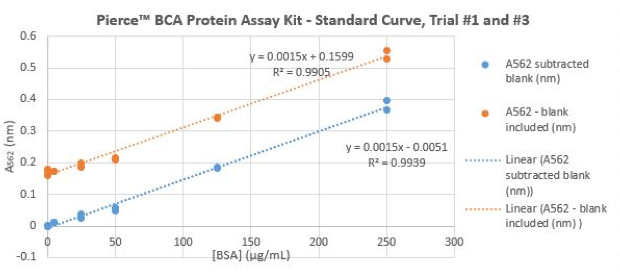

## 1. Preparing Standard Curves for Determining Free Sulfhydryl (SH) Concentration

### 1. A. Reagent Preparation: Preparing 250mL of 0.1M NaPO4 (pH 7.5)
1. Mark the day the solution was prepared, the concentration and the pH.
2. To make 0.1M NaPO4: Weigh 1.1694g NaH2PO4 and 5.9181g NaHPO4 in a 300mL beaker.
3. Dissolve NaH2PO4 and NaHPO4 using approximately 200mL dH2O.
4. Adjust pH=7.5 using 0.1N NaOH.
5. Transfer solution into 250mL volumetric flask and fill dH2O to calibration line.
6. Mix solution by inverting the volumetric flask.  

### 1. B. Reagent Preparation: Preparing 12.0mL of 6 M GuHCl 
1. Mark the day the solution was prepared, the concentration, and volume onto laboratory tape and place in 50 mL falcon test tube.
2. Weigh 6.8782 g of GuHCl and place into 50mL falcon test tube. 
3. Add 6.30 mL of 0.1M NaPO4 buffer (pH 7.5) and dissolve GuHCl to obtain a final volume of 12.0mL.

### 1. C. Reagent Preparation: Preparing 15.0mL of 0.01M DTNB stock solution and 0.001M of DTNB (1:10x dilution)
1. Mark the day the solution was prepared, the concentration, and the volume. Place onto 15 mL falcon tube.
2. To make 15.0mL of 0.01M DTNB stock solution: Weigh 0.059454 g of DTNB and dissolve in 15.0mL of 0.1M NaPO4 buffer (pH 7.5). Mix thoroughly.
3. To make 2.00 mL of 1:10x DTNB dilution: Pipette 200µL 0.01M DTNB stock solution and 1.80mL of 0.1M NaPO4 buffer (pH 7.5). This volume is suitable for more than 15 sample test tubes. Mix thoroughly.

### 1. D. Reagent Preparation: Preparing 0.1 M of 10.0 mL N-acetylcysteine (NAC) and 0.5mL of 0.001M NAC (1:100x dilution) 
1. To make 0.1M of 10.0mL N-acetylcysteine: Weigh 0.16319g of NAC and 10.0mL of 0.1M NaPO4 buffer (pH 7.5).
2. To make 0.001M of 0.5mL N-acetylcysteine: Pipette 5.0µL of 0.1M of 10.0mL NAC stock solution and 495µL of 0.1M NaPO4 buffer (pH 7.5).

### 1. E. Reaction Mixture Preparation
1. Collect 15 glass test tubes and label the first test tube in each row A-E. 
- Where A test tubes had [NAC] = 0 µM. 
- B test tubes had [NAC] = 5 µM. 
- C test tubes had [NAC] = 10 µM. 
- D test tubes had [NAC] = 30 µM. 
- E test tubes had [NAC] = 60 µM. 
2. Pipette 750µL of 6M GuHCl to each test tube 
3. Pipette 100µL of 0.001M DTNB to each test tube
4. Pipette corresponding 0.1M NaPO4 (pH 7.5) volume according to table.

|[NAC] (µM)  |NaPO4 volume required for each test tube (µL)|NaPO4 volume required for three test tubes (mL) | 
|------------|---------------------------------------------|------------------------------------------------|
|0           |650                                          |1.95                                            |
|5           |642.5                                        |1.928                                           |
|10          |635                                          |1.905                                           |
|30          |605                                          |1.815                                           |
|60          |560                                          |1.680                                           |

5. Pipette corresponding NAC volume according to table to achieve [NAC] = 0, 5, 10, 30 and 60µM. 

|[NAC] (µM)  |NAC volume required for each test tube (µL)  |NAC volume required for three test tubes (µL)   | 
|------------|---------------------------------------------|------------------------------------------------|
|0           |N/A                                          |N/A                                             |
|5           |7.5                                          |22.5                                            |
|10          |15                                           |45                                              |
|30          |45                                           |135                                             |
|60          |90                                           |270                                             |

6.	Incubate test tubes in dark for 10mins at room temperature using a bucket and a towel to cover test tubes. 
7.	Turn on spectrophotometer. 
8.	Record absorbance readings at 412nm and enter data into Microsoft Excel. Subtract the blank from all absorbance values recorded.

 
*Figure 1.1: Example of data collected on Microsoft Excel of NAC Standard Curve*
9. Select data of samples A412(nm) and samples A412 subtracted blan(nm) and use scatter plot graph. Add linear trendlines for absorbance values and display equation and R-squared values on chart.

*Figure 1.2: Example of [NAC] Standard Curve Equation Generated Using Microsoft Excel*

## 2. Preparing Standard Curves for Determining Soluble Protein Concentration

- Soluble Protein Concentration as determined according to [User Guide: Pierce BCA Protein Assay Kit](https://www.urmc.rochester.edu/MediaLibraries/URMCMedia/labs/ritchlin-lab/documents/MAN0011430_Pierce_BCA_Protein_Asy_UG.pdf)
- Prepare dilution according to dilution scheme for enhanced test tube protocol using one Bovine Serum Albumin Standard (BSA) ampule.  

### 2.A.Preparation of Diluted Bovine Serum Albumin (BSA) Standards
1. Collect 16 vials/test tubes (1 tube for A, replicates for B-F) and label the first test tube in each row A-F.
2. Pipette corresponding diluent volumes in each test tube according to the dilution scheme for enhanced test tube protocol. The diluent used was 0.1M NaPO4 buffer (pH 7.5) 
3. Pipette corresponding BSA volumes in each test tube. 
4. Mix diluent and BSA standard thoroughly by flicking test tube back and forth with index finger
5. Collect another 18 test tubes and label the first test tube in each row A1-F1.
6. Pipette 100µL of blank and other standards (250µg/mL, 125µg/mL 50µg/mL, 25 µg/mL, 5µg/mL. Create duplicates of each BSA concentration. 

### 2.B. Preparation of BCA Working Reagent (WR)
1. The following formula was used to determine the total volume of WR required: 
(# standards + # unknowns) x (# replicates) x (volume of WR per sample) = total volume WR required 
2. Pipette 2.0mL of WR for each sample in the test-tube procedure
3. Mix WR and diluted Bovine Serum Albumin (BSA) Standards thoroughly by flicking test tube back and forth with index finger. 

### 2.C. Experimental Test-Tube Procedure
1. Cover and incubate tubes at 37°C for 30mins in a water bath
2. Cool all tubes to room temperature 
3. Turn on spectrophotometer and set wavelength to 562nm. 
4. Record blank absorbance values first at 562nm. Then record absorbance of any other standard. Subtract the average 562nm absorbance measurements of the Blank standard replicates from absorbance values of all other unknown sample replicates  
5. Select the data of all samples A562(nm) and A562 subtracted blank(nm) and use scatter plot graph. Add linear trendlines and display equation and R-squared values on chart.

*Figure 2.1: Example of data collected on Microsoft Excel of BSA Soluble Protein Standard Curve, Trial #1*

*Figure 2.2: Example of BSA Protein Assay Standard Curve Equation Generated Using Microsoft Excel*
