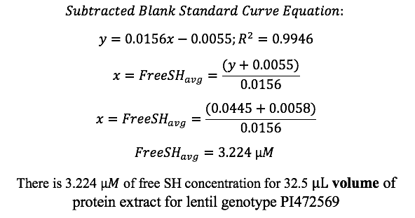
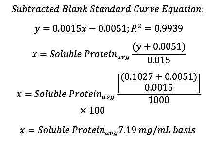
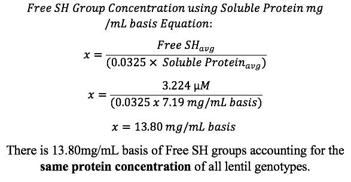

## 3.Preparing Lentil Extract

### 3.A. Reagent Preparation: Preparing 250mL of 0.1M NaPO4 (pH 7.5)
1. Mark the day the solution was prepared, the concentration and the pH
2. To make 0.1M NaPO4: Weigh 1.1694g NaH2PO4 and 5.9181g NaHPO4 in a 300mL beaker
3. Dissolve NaH2PO4 and NaHPO4 using approximately 200mL dH2O 
4. Adjust pH=7.5 using 0.1N NaOH 
5. Transfer solution into 250mL volumetric flask and fill dH2O to calibration line
6. Mix solution by inverting the volumetric flask 

### 3.B.Preparing Lentil Extract 
1. If preparing lentil extract of more than one lentil genotype, ensure 50mL falcon test tubes are clearly labelled with corresponding genotypes.  
2. Weigh 0.500g of lentil flour genotype into 50mL falcon test tube (triplicates of each lentil genotype was prepared). 
3. Add 10mL of 0.1M NaPO4 to each 50mL falcon test tube 
4. Use vortex mixer on auto speed 10 to thoroughly solubilize the pellet 
5. Place in waterbath at room temperature (~24°C) for an hour 
6. Filter extract using vacuum filter apparatus under water suction 
- Attach 125 mL sidearm flask to water suction tube 
- Use Buchner funnel, 125mL sidearm flask, and Whatman #1 filter paper and ensure pre-wetting filter using dH2O 
- Turn vacuum filter on by rotating it counterclockwise 1.5x 
- Turn off vacuum filter after dH2O  is collected in 125mL sidearm flask  
- Turn back on vacuum filter by rotating it counterclockwise 1.5x
- Pour lentil extract in Buchner funnel while vacuum filter is running and use 125mL sidearm flask to collect filtered extract 
- Pour filtered extract into new 50mL falcon test tube
7. After filtering is done, pipette aliquots (3-4mL) of lentil extract into separate 50mL falcon test tubes for unheated group and remaining for heated group 
- Label test tubes accordingly to indicate corresponding lentil genotypes and heated and unheated groups 
8. Place heated 50mL falcon test tube lentil extract (in triplicate) in waterbath at 90°C
9. Place unheated lentil extract (in triplicate) in separate waterbath at ~24°C
10. Filter lentil extract (in triplicate) of heated version using vacuum filter apparatus under water suction 
- Refer to step 5 for further details.

## 4.Determining Free Sulfhydryl (SH) Concentration

### 4.A. Reagent Preparation: Preparing 16.5mL of 6 M GuHCl 
1.	Using laboratory tape and a permanent marker, mark the day the solution was prepared, the concentration, and volume. Place onto 50mL falcon tube.  
2.	To make 16.5mL of 6M GuHCl (for 21 test tubes aka 3 different lentil genotype extracts (both heated and unheated) and triplicate blanks): Weigh 9.1709g GuHCl 
3.	Pipette ~4.0mL of 0.1M NaPO4 buffer (pH 7.5) into 9.1709g GuHCl and mix well, add slightly more NaPO4 for a final volume of 16.5mL

### 4.B.Reagent Preparation: Preparing 15.0mL of 0.01M DTNB stock solution and 0.001M of DTNB (1:10x dilution) 
10.	Mark the day the solution was prepared, the concentration, and the volume. Place onto 15 mL falcon tube.  
11.	To make 15.0mL of 0.01M DTNB stock solution: Weigh 0.059454g of DTNB and dissolve in 15.0mL of 0.1M NaPO4 buffer (pH 7.5)
12.	To make 2.20mL of 1:10x DTNB dilution: Pipette 220µL 0.01M DTNB stock solution and 1.98mL of 0.1M NaPO4 buffer (pH 7.5). This volume is suitable for more than 21 sample test tubes aka 3 different lentil genotype extracts (both heated and unheated) and triplicate blanks.  
13.	Mix thoroughly by flicking test tube back and forth with index finger

### 4.C.Reaction Mixture Preparation 
1. Collect a total of 21 glass test tubes and label first test tubes in each row A-G. Where A is one lentil genotype (heated), B is one lentil genotype (unheated), C is different lentil genotype (heated), D is same lentil genotype as C (unheated), E is another different lentil genotype (heated), F is same lentil genotype as E (unheated), G is triplicate blanks 
2. Pipette 750µL of 6M GuHCl in each test tube 
3. Pipette 100µL of 0.01M DTNB in each test tube 
4. Grab the lentil genotype extract both heated and unheated versions, and pipette 32.5µL of heated extract into corresponding test tubes. Then pipette 32.5µL of unheated extract into corresponding test tubes. Switch pipette tips between unheated and heated versions and different lentil genotype extracts. 
650µL*(1 protein)/(20 NaPO4 buffer)=32.5µL protein extract for each test tube 
Where 650µL is total of protein extract and NaPO4 buffer according to (Mession, Chihi, Sok, Saurel 2015). 
5. Pipette 617µL of NaPO4 buffer into each test tube
6. Mix reaction mixture thoroughly by flicking test tubes back and forth with index finger. 
7. Incubate test tubes in dark at room temperature for 10min.
8. Turn on spectrophotometer and set wavelength to 412nm. 
9. Immediately after 10 mins, record absorbance readings at 412nm using disposable cuvettes.

## 4.D.Calculate Free Sulfhydryl (SH) concentration in µM
1. Use the standard curve equation and subtracted blank absorbance values to calculate free sulfhydryl concentration

*Figure 4.1: Example of lentil genotype A412(nm) values*

## 5.Determining Soluble Protein Concentration

### 5.A. Preparation of Lentil Extract Sample Dilutions (1:100x)
1. To prepare heated lentil extract dilution (1:100x): Pipette 10µL of heated lentil extract and 990µL of 0.1M NaPO4 buffer (pH 7.5) into clean 15mL falcon test tubes. Do the same for the remaining replicates and for different heated lentil extract genotypes
2. To prepare unheated lentil extract dilution (1:100x): Pipette 10µL of unheated lentil extract and 990µL of 0.1M NaPO4 buffer (pH 7.5) into clean 15mL falcon test tubes. Do the same for the remaining replicates and for different unheated lentil extract genotypes

### 5.B. Preparation of BCA Working Reagent (WR)
1. The following formula was used to determine the total volume of WR required: 
(# standards + # unknowns) x (# replicates) x (volume of WR per sample) = total volume WR required 
2. Pipette 2.0mL of WR for each sample in the test-tube procedure
3. Mix WR and diluted Bovine Serum Albumin (BSA) Standards thoroughly by flicking test tube back and forth with index finger. 

### 5.C. Experimental Test-Tube Procedure 
1. Turn on the waterbath and set temperature to 37°C
2. Pipette 100µL of lentil extract protein dilution (1:100x) for both unheated and heated versions into clean glass test tubes. 
3. To create the blank, pipette 100µL of 0.1M NaPO4 buffer (pH 7.5) into clean glass test tube, create triplicates of the blank.
4. Pipette 2.0 mL of WR into each glass test tube 
5. Thoroughly mix the protein extract and WR by flicking the test tube back and forth with index finger.
6. Place test tubes in waterbath and incubate test tubes at 37°C for 30mins
7. Turn spectrophotometer on and set wavelength to 562nm. 
8. Cool all tubes to room temperature 
9. Record the absorbance of the samples at 562nm after 30 mins and subtract the average 562nm absorbance measurements of the Blank standard replicates from absorbance values of all other unknown sample replicates  
10. Select the data of all samples A562(nm) and A562 subtracted blank(nm) and use scatter plot graph. Add linear trendlines and display equation and R-squared values on chart.

### 5.D. Calculate Soluble Protein concentration in mg BSA equivalent/mL extract 
1. Use the standard curve equation and subtracted blank absorbance values to calculate soluble protein concentration 
Sample Calculation of Soluble Protein Concentration: 

*Figure 5.1: Example of lentil genotype A562(nm) values*

-**BSA equivalents are expressed in µM ∴ 1 mL = 1000µL**
-**Multiplied by 100 to determine mg/mL soluble protein with appropriate dilution factor (1:100x dilution)**

## 6.Calculating Free SH Group Concentration using Soluble Protein mg/mL basis

**This equation accounts for the same protein concentration of lentil genotypes and not the volume**
